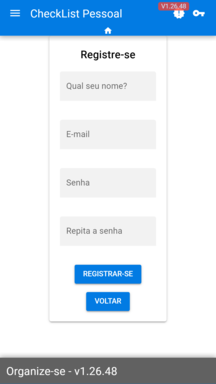
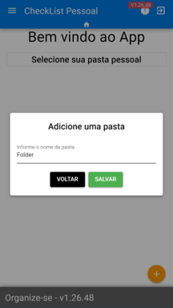
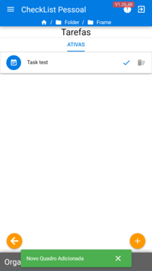
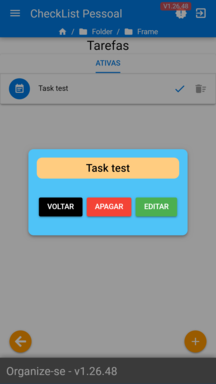

## ChecklistPessoal - Web Version


Login Screen             |  Register Screen          |NavDrawer
:-----------------------:|:-------------------------:|:-----------------------:
      |     | 

Add Folder               |Folder List                |Add Boards
:-----------------------:|:-------------------------:|:-----------------------:
  |   |

Add Task List            |  Task List                | Task View
:-----------------------:|:-------------------------:|:-----------------------:
   |    | 


#### Conceito / Concept
> EN: This project is part of my portfolio and is associated with my small development studio (symbol2studio), initially it was created in Java for Android, the idea consists of a simple task manager (checklist), whose organization comes in 3 levels, being "Folder "," Board ", and" Task ", Tasks contain 2 statuses, Active and Completed, if completed, the Task receives a new field called" Completion Note "in which it is possible to add some extra information.

> BR: Este projeto faz parte do meu portfólio e está associado a meu pequeno estúdio de desenvolvimento (symbol2studio), inicialmente ele foi criado em Java para Android, a ideia consiste em um simples gerenciador de tarefas (checklist), cuja a organização vem em 3 níveis, sendo "Pasta", "Quadro" e "Tarefa", as Tarefas contém 2 status, sendo Ativo e Concluído, caso concluído, a Tarefa recebe um novo campo chamado "Nota de Conclusão", no qual é possível agregar alguma informação extra.


#### The Model
```json
[
  {
    "app": {
      "username": "João M.",
      "uid": "123abc",
      "createdAt": "timestamp here",
      "folder": [
        {
          "id": "1",
          "title": "folder title",
          "createdAt": "timestamp here",
          "updatedAt": "timestamp update",
          "board": [
            {
              "id": "1",
              "title": "title board",
              "createdAt": "timestamp here",
              "updatedAt": "timestamp update",
              "task": [
                {
                  "id": "1",
                  "finished": "Boolean",
                  "content": "Description here",
                  "finishNotes": "Additional content here upon completion",
                  "createdAt": "timestamp here",
                  "updatedAt": "timestamp update"
                }
              ]
            }
          ]
        }
      ]
    }
  }
]
```